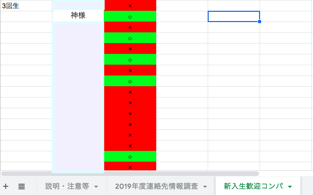

# CAConfirm
   

## 概要
___
研究発表で話した内容です。  
幹部から送られて来るGoogleフォームに答えたかどうかをスプレッドシートで答えていたら緑背景に丸印、そうでない場合は赤背景に罰印を自動的に書き込むシステムです。（トリガーはユーザのフォーム送信）  
以下の画像がプレビューです。  

  
___  
## 拡張機能  
___  
* **Webページの作成(学生証番号でログインして個人のページ込み)**  
現在使っているようなスプレッドシートは管理用の画面であって、ユーザの画面には適さない。  
ユーザが毎度毎度、名前・メアドを入力するのは負担がかかる。  
唯一判断材料になる学生証番号をキーにしてログイン機能的なものを作ればいい。  
  
* **機嫌が過ぎた地点でSlackに通知**  
Slack内にユーザ個人個人の固有IDがあるのでそれを用いて知らせる。  
